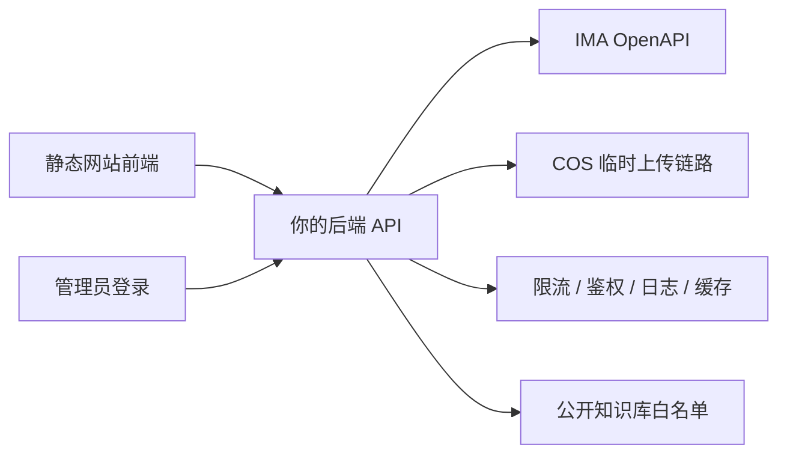

# IMA 安全接入后端方案

## 1. 目标

当前网站是纯静态页：

- [index.html](/Users/Zhuanz/Documents/vibe%20coding/portfolio-zhangmeilong-v3/index.html)
- [script.js](/Users/Zhuanz/Documents/vibe%20coding/portfolio-zhangmeilong-v3/script.js)

这意味着前端不能直接调用 IMA OpenAPI，因为：

- `Client ID` 和 `API Key` 一旦写进前端，就等于公开泄露
- 任意访客都能直接拿你的账号调用知识库和笔记接口
- 文件上传流程还会涉及 COS 临时凭证，前端直连更难做安全控制

所以正确做法是：

`静态简历网站前端 -> 你自己的后端 API -> IMA OpenAPI / COS`

## 2. 核心结论

推荐采用“双通道”方案，而不是把你的个人 IMA 账号全量暴露给公开网站。

### 通道 A：公开访客通道

给招聘方、面试官、访问你网站的人使用。

只开放有限能力：

- 查看你精选的知识库内容
- 搜索公开知识库中的项目资料
- 调用“项目资料检索 / 项目问答”类能力

这条通道必须：

- 只访问“公开展示专用知识库”或“你手动筛选后的内容”
- 严格限流
- 不允许写入
- 不允许上传文件
- 不允许访问个人笔记

### 通道 B：你自己的管理通道

只给你自己登录后使用。

开放管理能力：

- 上传文件到指定知识库
- 把新项目材料同步进知识库
- 搜索 / 浏览知识库
- 创建或追加笔记

这条通道必须：

- 登录后才能用
- 具备操作日志
- 能区分 public / private 知识库

## 3. 推荐架构



## 4. 为什么不建议“直接接你的个人知识库”

如果你的简历站是公开网址，直接把个人 IMA 知识库接给访客，会有几个明显风险：

1. 访客可以穷举搜索你的资料
2. 恶意请求会消耗你的接口额度
3. 如果后面开放上传、笔记写入，会直接污染你的个人空间
4. 即使只读，也可能把本来不想公开的资料暴露出去

所以更稳的设计是：

- 你在 IMA 里单独准备一个“个人作品公开知识库”
- 只放适合公开展示的项目材料
- 网站前端只查这个库
- 私人笔记和其他知识库只通过管理后台访问

## 5. 后端职责边界

后端不只是“转发请求”，还要承担安全控制。

### 必须由后端完成的事

- 保存 `IMA_OPENAPI_CLIENTID` 和 `IMA_OPENAPI_APIKEY`
- 调用 IMA API
- 上传文件到 COS
- 控制哪些知识库可被访问
- 控制哪些接口只允许管理员使用
- 限流、日志、错误处理、缓存

### 不应该交给前端的事

- 持有 API Key
- 直接请求 `ima.qq.com`
- 直接请求 COS 上传凭证
- 直接访问私人笔记 / 私有知识库

## 6. 推荐的后端模块

建议后端按下面的结构拆：

```text
backend/
  src/
    app.js
    routes/
      public.js
      admin.js
    services/
      ima-client.js
      ima-kb-service.js
      ima-notes-service.js
      ima-upload-service.js
    middleware/
      auth.js
      rate-limit.js
      require-admin.js
    utils/
      logger.js
      validators.js
      sanitize.js
    config/
      env.js
```

## 7. 推荐接口设计

下面这组接口最适合你当前的网站阶段。

### 7.1 公开接口

#### `GET /api/health`

用途：

- 前后端健康检查
- 部署后自测

返回：

```json
{
  "ok": true,
  "service": "portfolio-ima-api"
}
```

#### `GET /api/public/kb`

用途：

- 返回你公开展示用知识库的基本信息

典型返回：

```json
{
  "id": "public_kb_id",
  "name": "张梅龙项目知识库",
  "description": "用于展示项目案例、作品说明与复盘资料"
}
```

#### `POST /api/public/search`

用途：

- 让访客按关键词搜索公开知识库

请求：

```json
{
  "query": "面试复盘"
}
```

返回：

```json
{
  "items": [
    {
      "media_id": "xxx",
      "title": "AI 面试复盘网站设计说明",
      "snippet": "沉淀 8 维评分、风险识别和问答优化模块"
    }
  ]
}
```

#### `GET /api/public/project/:slug`

用途：

- 给前端项目卡片提供结构化内容
- 例如 `jingyin-agent`、`ai-interview-review`

说明：

- 这层不一定非要直接从 IMA 查，也可以走“后端缓存后的整理结果”
- 这样前端会更稳定，页面也更快

### 7.2 管理接口

这些接口必须管理员登录后才能访问。

#### `POST /api/admin/login`

推荐：

- 先用最轻量方案：单管理员密码登录 + HttpOnly Cookie Session
- 以后再升级成短信 / 邮箱验证码

#### `GET /api/admin/kb/list`

用途：

- 列出你可操作的知识库

#### `POST /api/admin/kb/search`

用途：

- 搜索指定知识库内容

#### `POST /api/admin/kb/upload`

用途：

- 上传 PDF、图片、Markdown、音频等文件到知识库

后端流程：

1. 校验登录态
2. 校验文件类型和大小
3. 调用 `create_media`
4. 用返回的临时凭证上传到 COS
5. 调用 `add_knowledge`
6. 返回上传结果

#### `POST /api/admin/notes/create`

用途：

- 新建笔记

#### `POST /api/admin/notes/append`

用途：

- 往已有笔记追加内容

说明：

- 这类写接口必须加操作确认和日志
- 防止误写你的真实笔记

## 8. 安全设计

这是这套方案最重要的部分。

### 8.1 凭证管理

必须使用服务端环境变量，不要写死在代码里：

- `IMA_OPENAPI_CLIENTID`
- `IMA_OPENAPI_APIKEY`

部署时放进：

- Railway / Render / Fly.io / 腾讯云环境变量

不要放进：

- `index.html`
- `script.js`
- Git 仓库

### 8.2 知识库白名单

公开接口只允许访问白名单中的知识库：

- `IMA_PUBLIC_KB_ID`

不要允许前端传任意 `kb_id`，否则访客可以遍历你的其他知识库。

### 8.3 限流

公开接口至少要做：

- IP 级限流
- 单分钟搜索次数限制
- 单日请求总量限制

建议初始值：

- `search`: 每 IP 每分钟 10 次
- `project detail`: 每 IP 每分钟 30 次
- `admin`: 更严格，且仅登录后可用

### 8.4 管理接口鉴权

管理接口推荐：

- 账号密码登录
- 成功后写入 HttpOnly Cookie
- 服务端校验 session

不要用：

- 前端 localStorage 存明文 token
- query 参数传 token

### 8.5 输出脱敏

即使从 IMA 拿到完整内容，公开接口也不要原样透出所有字段。

只返回前端需要的字段，比如：

- 标题
- 摘要
- 关键词
- 项目片段

不要直接把整份原始 API 响应丢给前端。

### 8.6 审计日志

建议记录：

- 谁调用了管理接口
- 上传了什么文件
- 写入了哪个知识库
- 是否成功
- 错误码是什么

但不要记录：

- API Key 原文
- 完整 Cookie
- 敏感正文全文

## 9. 推荐技术栈

考虑到你当前项目很轻，推荐后端也保持轻量。

### 方案 A：Node.js + Fastify

优点：

- 轻
- 快
- 容易加中间件
- 和你现在的前端项目风格一致

适合你当前阶段，推荐优先用这个。

### 方案 B：Node.js + Express

优点：

- 资料多
- 容易上手

缺点：

- 稍微传统一些

如果你更熟悉 Express，也完全可以。

## 10. 部署建议

### 前端

继续静态部署：

- Vercel
- Netlify
- 腾讯云静态托管

### 后端

单独部署：

- Railway
- Render
- Fly.io
- 腾讯云轻量应用服务器

推荐最开始前后端分离：

- 前端域名：`www.xxx.com`
- 后端域名：`api.xxx.com`

## 11. 最适合你的 MVP 路线

我建议不要一上来就把所有能力都做完，先分 3 步。

### Phase 1：公开可展示

先做：

- `GET /api/health`
- `GET /api/public/kb`
- `POST /api/public/search`

目标：

- 让你的个人网站先具备“可搜索项目资料”的展示能力

### Phase 2：你自己的管理后台

再做：

- 管理员登录
- 知识库列表
- 文件上传
- 项目资料同步

目标：

- 让你自己能维护网站展示内容

### Phase 3：更强的交互层

如果后面你想把网站做成更像个人 AI 名片，再加：

- 项目问答
- 访客留言转知识库
- 面试复盘 demo 上传体验

## 12. 对你这个网站最合适的落地方向

如果只从“简历网站”这个场景出发，我建议优先做这个能力，而不是一开始做全量知识库系统：

### 最推荐的第一个功能

`项目资料检索 + 项目详情 API`

也就是：

- 访客在你网站上点某个项目
- 前端调 `/api/public/project/:slug`
- 后端去读你整理好的公开知识库内容
- 返回项目摘要、关键能力、成果、附件链接

这个路径最适合招聘场景，因为它会把“简历页面”升级成“可验证的项目资料页”。

## 13. 我建议你下一步直接做什么

如果你认同这版方案，下一步最值得直接实现的是：

1. 在项目里补一个轻量 `backend/`
2. 先把 `health + public search + public project detail` 三个接口做出来
3. 前端给“项目效果预览”按钮接上你自己的后端接口

这样你的网站就从“静态简历”变成了“带资料检索能力的动态作品站”。
